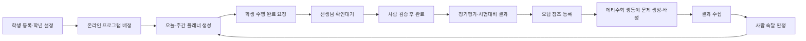

# WB 통합 학습 플랫폼 v2 설계

## 결정

새 앱을 따로 만드는 대신 기존 `/consult/` 안에 통합 학습 탭을 추가한다. 현재 화면·학생·업무 데이터는 유지하고, 신규 기능은 독립 모듈과 버전이 있는 D1 모델로 확장하는 하이브리드 방식이다.

검토한 대안은 다음 세 가지다.

1. 기존 단일 HTML에 계속 직접 추가: 빠르지만 권한·동기화·테스트 경계가 약해진다.
2. 전면 재작성: 장기 구조는 단순해질 수 있지만 현재 운영 기능과 데이터의 회귀 위험이 크다.
3. 기존 앱 UX + 모듈형 v2 기반: 현재 URL과 사용법을 유지하면서 단계적으로 v2 API로 이전할 수 있다. 이 방식을 채택했다.

## 전체 워크플로우

외부 프로그램 결과는 바로 완료가 되지 않는다. `가져오기 → 미리보기 → 형식·학생·중복·자격정보 검증 → 승인 후보 → 사람 반영` 순서만 허용한다.

## 학년별 시험대비

초등은 학교 정기시험을 기본 생성하지 않는다. 학생별 필요가 있을 때 다음 캠페인만 선택해 연결한다.

- 경시대회
- KMT
- NELT
- 영재원
- 입학시험
- 레벨테스트
- 사용자 지정 시험

초등 캠페인은 초안을 만든 뒤 학생·보호자 동의와 일정을 사람이 확인해야 활성화된다. 중·고등은 같은 `prep_campaign` 모델에서 학교 중간·기말·정기시험을 추가로 선택할 수 있다.

## 정기평가

- NELT: 기준일로부터 3개월 간격
- 메타수학 주간평가: 지정 요일
- 메타수학 월말평가: 월말 회차

회차 ID와 플래너 ID는 학생·평가종류·회차를 기반으로 결정적으로 생성해 같은 기간을 다시 확장해도 중복되지 않는다. 평가 자체의 시험시간은 일반 자율학습 1회 소프트캡에서 제외하지만 주간 총량에는 포함한다.

## 온라인 프로그램 확장

프로그램별 화면 분기를 늘리지 않고 provider registry와 capability로 관리한다. 현재 기본 공급자는 스터디포스, 클래스카드, 메타수학, NELT이며 이후 공급자는 registry 항목과 정규화 규칙으로 추가한다.

공개 API 계약이 확인되기 전에는 계정 자동 로그인이나 크롤링을 하지 않는다. 운영 MVP는 현재 구현·검증된 CSV·JSON 결과의 수동 후보 등록이다. PDF 파서는 구현되지 않았으므로 PDF를 지원한다고 표시하지 않으며, 추후 별도 파서·크기 제한·실패 격리·회귀 테스트를 갖춘 뒤 후보 입력 형식으로 추가한다. 공식 API 계약이 생기면 같은 후보 형식으로 어댑터를 추가한다.

legacy bridge가 활성화된 동안 프로그램 결과 이력은 provider별 최근 최대 20건·8KB를 보존한다. 한도를 넘으면 오래된 이력부터 정리하고 historyRetention.droppedCount에 누적 정리 건수를 남긴다. 개별 snapshot data는 4KB를 넘길 수 없으며, 이 상한은 4개 기본 provider가 함께 있어도 lpcore 56KB 저장 한도에 여유를 두기 위한 것이다. v2 API로 전환한 뒤에는 서버 원장을 기준으로 보존 정책을 다시 결정한다.

### 공식 기능 확인과 연동 경계 (2026-08-03 확인)

- [NELT 접수 안내](https://www.nelt.co.kr/testReception/receptionGuide)는 실력 추이 확인을 위해 약 3개월 간격의 응시를 권장하고 시험 종료 뒤 결과 페이지에서 바로 확인할 수 있다고 안내한다. 따라서 3개월 일정과 결과 승인 원장은 실제 서비스 흐름과 맞지만, 결과 자동 수집은 별도 API 계약 전까지 하지 않는다.
- [메타수학 공식 소개](https://www.mmath.co.kr/)는 교재·참고서 매칭 쌍둥이/유사유형 문제, 자동채점, 평가분석을 제공하고, [KMT 공식 안내](https://n.mmath.co.kr/pages/home/promotion/service/kmt/)는 연 4회 정기평가를 안내한다. 앱은 문제 원문을 복제하지 않고 문제세트·배정·결과 참조와 사람의 숙달 판정만 보관한다.
- [클래스카드 공식 소개](https://grammar.classcard.net/)는 학습 리포트, 자동채점, 오답 다시 풀기 기능을 안내한다. [스터디포스 공식 사이트](https://www.studyforce.co.kr/)는 학교·학원용 프로그램 공급과 관리형 훈련을 안내한다. 두 서비스 모두 계정 자동 로그인 대신 승인형 결과 후보로 연결한다.
- [TodoMate 공식 앱 설명](https://play.google.com/store/apps/details?id=com.undefined.mate)은 할 일·주간/월간 루틴·타이머·리마인더·기기 간 이용을 핵심 기능으로 안내한다. WB 플래너는 이 중 학습에 필요한 일/주 계획, 상태, 시간, 이동·이월만 적용하고 친구 공개·일기·AI 자동판정은 범위에서 제외한다.

위 공식 공개 페이지에서 일반 사용자를 위한 공개 API 문서는 확인하지 못했다. 이는 API가 존재하지 않는다는 단정이 아니라, 계약·권한·기술 문서를 공급자에게 별도로 확인하기 전에는 자동 연동을 열지 않는다는 운영 판단이다.

자격정보 처리 원칙:

- 비밀번호·토큰·쿠키 열이 있으면 해당 행 전체를 차단한다.
- 비밀값은 해시 입력에도 포함하지 않는다.
- 계정은 비밀번호가 아닌 `accountIdRef` 또는 외부 식별자 해시만 저장한다.
- 가져온 결과는 사람이 승인하기 전 완료·숙달·원장 반영 상태가 아니다.

## 오답과 메타수학 쌍둥이 문제

저장하는 것은 `교재 ID·판/단원·쪽·문항 번호·기술 코드`와 외부 결과 참조뿐이다. 문제 원문·정답·해설 본문은 저장하지 않는다.

상태 흐름은 다음과 같다.

`오답등록 → 쌍둥이 생성요청 → 문제세트 연결 → 선생님 검토 → 학생 배정 → 제출 → 결과 연결 → 사람 확인대기 → 숙달 또는 재학습`

실제 쌍둥이 문제 생성은 라이선스가 있는 메타수학에서 수행한다. 메타수학 공개 API가 확인되지 않은 현재 단계에서는 문제세트·배정·결과 참조를 수동으로 연결한다.

## 데이터·동기화 구조

- 기존 `staff/tasks/checks`: 현재 앱 호환과 즉시 운영을 위한 v1 경로
- 분할 학습 상태: 기존 동기화의 등록된 특수 check key를 이용하는 임시 bridge
- `lp_*` 테이블: 역할·revision·멱등키·감사 로그가 있는 v2 기반
- `lp_legacy_links`: 검증된 엔터티부터 v1↔v2로 단계 이전할 연결 원장

v2 마이그레이션은 기존 세 테이블을 변경하지 않는 추가형이다. 프런트엔드는 당분간 bridge를 사용하고, v2 세션과 principal 부트스트랩이 끝난 기능부터 API로 옮긴다.

## 보안 경계

- 관리자 PIN: PBKDF2-SHA256, 120,000회, 무작위 salt
- 관리자 비밀키와 PIN: URL·백업·직원/학생 데이터에서 제외
- 구형 `s=` 비밀정보 복구 링크: 내용을 흡수하지 않고 URL에서 제거
- 개인 링크: 장기 bearer를 URL에 넣지 않는다. `#c=`의 24시간 유효 1회용 code를 네트워크 요청 전에 제거하고 교환하며, bearer는 90일 후 만료된다. code·bearer 모두 서버에는 `sha256:<digest>`만 저장한다.
- 링크 회전·해지: 새 code를 복사하는 것만으로 기존 기기를 끊지 않고, 교환 성공 시 원자적으로 기존 bearer를 회전한다. 관리자는 학생/직원 단위로 bearer와 미사용 code를 즉시 해지할 수 있다.
- manager: 전체 현황 조회와 타인 업무 발행은 가능하지만 토큰 관리 불가
- consult person: 자기 owner 범위와 현재 플래너에 존재하는 `lpclaim` 완료요청만 쓰기 가능
- task person: 자기 staff/tasks/attendance만 읽고, 운영상 전 직원이 기록하는 `ct/exam/op/opset` 4종 check만 allowlist로 공유한다.
- D1 v2: tenant·student scope와 역할 권한 기반을 포함하지만 운영에서는 `LEARNING_V2_ENABLED=false`로 health만 공개한다.
- 강좌 가져오기: 허용 호스트, 리디렉션 재검사, 10초·2MB 제한, 자격증명 미전송

## 알려진 단계적 제약

- 메타수학·NELT·스터디포스·클래스카드의 공식 API 계약은 아직 확인되지 않았다.
- 따라서 외부 계정 변경·자동 제출·문제 원문 수집은 구현 범위가 아니다.
- v2 API 기반은 준비했지만 운영 principal/session 부트스트랩, tenant별 assessment registry, request-hash idempotency, legacy 건수/hash 대조가 끝날 때까지 `LEARNING_V2_ENABLED=false`를 유지한다.
- legacy bridge는 프로그램 provider별 최근 20건·8KB, 개별 snapshot 4KB, 학습 조각 56KB, 브라우저 전체 상태 4MB 한도를 둔다. 활성 학생과 provider가 늘기 전에 v2 서버 원장 이전이 필요하다.
- legacy import ledger는 한 동기화 배치로 원자 저장하지만 서버 고유키 원장으로 전환되기 전에는 동일 학생을 여러 관리자 기기에서 동시에 승인하지 않는 단일 승인자 운영을 권장한다.
- 캠페인과 플래너의 실제 자동 알림 발송은 별도 승인·중복방지·발송 원장 없이는 실행하지 않는다.

## Codex 역할

[Codex] 기존 앱과 데이터 흐름을 분석하고, 모듈·D1 스키마·권한·가져오기 검증·상태 머신·테스트·복구 절차를 설계하고 구현한다. 외부 계정 변경이나 확인되지 않은 완료 판정은 하지 않는다.

## 코워크 역할

[코워크] 정기 일정 생성, 프로그램 결과 후보 수집, 확인대기·이월·오답 재확인 후보 생성, 중복키 확인과 오류 큐 기록을 반복 실행한다. 기본 실행 모드는 `dry_run` 또는 후보 생성이다.

## 사람 승인 게이트

[승인필요] 운영 배포, 외부 공급자 계정·권한 변경, 프로그램 결과 실제 반영, 학생·보호자 동의가 필요한 캠페인 활성화, 학습 완료 검증, 오답 숙달 판정, 실제 메시지 발송은 사람이 승인한다.

[보류] 공식 API 계약과 이용 권한이 확인되지 않은 공급자의 자동 로그인·크롤링·문제 생성은 보류한다.

## 반복 실행 흐름

`후보 수집 → 정규화 → 자격정보 제거 → 학생 매핑 → 멱등·충돌 검사 → 확인대기 → 사람 승인 → 적용 → 감사 로그 → 오류/재시도 큐`

## 에이전트 간 전달물

- `online_program_state_candidate`
- `planner_draft`
- `learning_check_waiting`
- `carryover_candidate`
- `assessment_result_candidate`
- `prep_campaign_draft`
- `twin_problem_generation_request`
- `mastery_review_waiting`
- `program_check_needed`

모든 전달물은 tenant, student, provider/source, idempotency key, revision, 생성시각, 생성주체, 근거 참조를 포함한다.

## 로그/인수인계 기준

완료로 보고하려면 테스트 결과, 적용 revision, 승인자, 적용시각, 근거 참조, 중복키, 실패·보류 사유를 남긴다. 비밀번호·토큰·쿠키·문제 원문은 로그와 인수인계 문서에 남기지 않는다.
