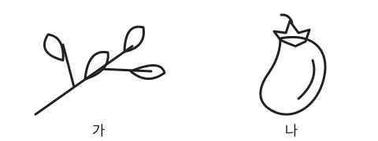

# 초4 준비 과정 — 학생용 검토자료 v0

> 작성 2026-10-07 · **실제 배부 전에 교사가 선택·검수할 학생용 후보 모음**
> [교사용 검토팩](초4-준비과정-교사용-검토팩-v0.md)과 [4주 수업안](초4-삼육중-영재원-4주-수업안-v0.md)의 자체 창작 예시를 재사용했다. A 화~금 16일과 B 4회를 담았다.
> 이 문서 전체를 가족에게 배부하지 않는다. 실제 개설·배정·배부·시행·새 기록 수집은 미확정이며, 수업 시간·교육 효과·실험 결과와 안전성은 검증 전이다. 기관의 공식 교육과정·선발 문항·현재 앱 기능이 아니다.

## 교사가 한 장으로 고르는 방법

- A/B 중 정한 경로 하나만 고른다. 기존 활동을 대체하며 추가 숙제로 붙이지 않는다. A 월요일은 교사와 기존 수업 안 학생별 10분이며, 가정용 월요일 활동은 만들지 않는다. 화~금은 요일별 한 장, 각 최대 10분이다. 금요일은 국어·수학·영어 각 3분과 정리 1분 안에서 마친다. 이 시간은 교사 예산이며 아이에게 카운트다운·점수 압박을 주지 않는다.
- 월요일에 한 주의 선택한 자료를 제공하고 다음 수업에서 표시한 질문을 확인하는 방안의 후보다. 실제 배부 담당·방식·시행은 미정이며 이 문서 작성으로 배부를 시작하지 않는다.
- 각 날짜의 **제시문·질문·필요한 표/기호와 표현할 여백**을 한 장으로 추출한다. 그림·쓰기를 고른 아이가 표현할 공간을 아래쪽에 남기고 종이 뒷면도 쓸 수 있게 안내한다. 수학은 학교 진도와 앞서 실제 만난 목표를 확인해 **원자료 또는 자연수 대안 한 개만** 제공한다. 아래 대안은 교사 검토용 후보이며 함께 풀 문제가 아니다. 1주에 자연수 목표를 선택했다면 2~3주도 그 목표를 유지할 수 있고, 주 번호에 맞춰 새 단원으로 넘어가지 않는다. 이 문서에 목표와 맞는 후보가 없으면 배정하지 않고 교사가 다시 검토한다.
- 영어는 이미 배운 낱말·글자 형태·표현을 확인한 교사가 **그림 선택/낱말 연결/말하기 중 한 종류**를 준비한다. 제시된 영어는 배운 경우에만 쓸 후보다. 가정 듣기·새 낱말 암기·새 문장 외우기를 요구하지 않는다. 배운 영어가 없으면 익숙한 그림을 고르거나 한국어로 이름을 말하는 대안 하나만 제공한다.
- A 4주 수학은 앞서 선택한 범위 **한 종류를 수·금에 유지**한다. 후보 번호를 유지하고 다른 후보를 삭제한 한 장만 만든다. 가족에게 후보 전체를 배부하지 않는다. 더 쉬운 범위를 썼다면 그대로 유지한다.
- B는 기존 수업 안 30분(질문·준비 5분, 활동 15분, 정리 5분, 돌아보기 5분) 후보다. 가정에서는 원할 때 자기 표현 하나를 다시 보는 최대 10분 한 번만 제안한다. 생략해도 다음 활동을 이어 간다. 평일 카드·종이 회차를 더하지 않는다.
- 정답·교사 확인 근거·평가 메모·실제 학생 정보는 넣지 않았다. 빈칸은 인쇄·가상 모의 진행을 위한 표현 공간이며 새 기록 수집·제출 지시가 아니다. 검토에서는 빈 자료나 완전히 자작한 가상 자료만 쓰고 실제 아동 기록을 익명화해 가져오지 않는다.

### 교사가 제공할 자료

| 활동 | 이 문서에서 바로 인쇄할 것 | 교사가 기존 교실 물건으로 제공할 것 |
|---|---|---|
| A 국어 | 제시문과 질문. 지원이 필요할 때만 아래 행동 기호·낱말 그림 후보 | 별도 구매 없음 |
| A 자릿값·자연수 | 자리 표·점 그림·빈 묶음 표 중 선택한 한 종류 | 필요하면 기존 작은 물건. 보호자·아이에게 새 그림 제작을 맡기지 않음 |
| A 분수·소수 | 칸 수가 같은 띠, 같은 크기의 10×10 표 두 개. 칸의 `■`는 칠한 부분, `□`는 빈 부분 | 별도 격자 제작·교재 구매 없음 |
| A 영어 | 선택한 낱말/표현 카드와 아래 기호 후보 | 배운 물건 후보인 책·연필·필통 중 필요한 실물. 음식은 아래 기호를 인쇄해 사용 가능 |
| B 1·4회 | 색·모양/무늬·목도리 카드와 빈 2×2 표 | 종이·연필. 상자·옷을 구매하지 않음 |
| B 2회 | 타일 기호와 빈 절차 칸 | 종이 타일 9개 이상을 교사가 제공 |
| B 3회 | 조건·안전 안내와 빈 관찰 표 | 같은 종류 A4 종이 2장, 같은 높이 책 받침 두 개, 자, 비슷한 지우개 3개. 교사가 접기·받침 설치·초기화·손상 시 교체 담당 |

기호는 글·실물의 대체 제시 후보다. 읽기 대신 기호를 썼거나 영어 글 대신 그림만 고른 것을 직접 읽기·영어 듣기로 보지 않는다. 실제 선택·검수·배부 담당과 방식은 시행 전에 정한다.

### 선택한 한 장에 붙일 아이·보호자 안내

> 모르면 표시해 두고 다음 수업에서 선생님과 만나 봐요. 가리키기·말·그림·물건·쓰기 중 편한 방법으로 설명해도 돼요. 그림·쓰기는 이 종이의 빈 곳이나 뒷면에 표현해도 돼요. 피곤하면 짧게 하거나 멈춰요. 빠진 활동을 몰아서 하지 않고 주말은 쉬어요. 금요일에 다 못 만나면 다음 월요일에 하나만 다시 만나 봐요. 보여 주고 싶은 한 줄·그림 하나를 고르거나 공유하지 않아도 돼요.
>
> 보호자는 종이·연필과 편한 자리를 마련해 주세요. 답·근거·좋은 문장을 만들어 주거나 그림·문제·해설·음성을 새로 준비하지 않습니다. 사진·서명·매일 확인표·교재 구매·제출은 요구하지 않습니다.

## A 1주 — 사실과 이유·자릿값·배운 물건 표현

### A-1-화 · 국어

**제시문**

> 책상 아래에 색연필 한 자루가 떨어져 있었다. 수아는 색연필을 주워 바구니에 넣었다. 바구니 옆에는 같은 색연필들이 있었다.

**질문**: 수아가 한 일을 글에서 가리키고, 색연필을 어디에 넣었는지 말해 보자.

읽기 대신 그림 제시가 필요한 경우에만 교사가 다음 두 기호를 제공한다. 글과 그림을 모두 추가 활동으로 배정하지 않는다.

| 그림 가 | 그림 나 |
|---|---|
| `책상 ─────` `아래 색연필 ✎` | `바구니 ［ ✎ ］` `옆 색연필 ✎ ✎` |

### A-1-수 · 수학

**교사 선택 후보 1 — 큰 수 자릿값**

자료: **23,015**

| 만 | 천 | 백 | 십 | 일 |
|---|---|---|---|---|
| 2 | 3 | 0 | 1 | 5 |

질문: 3이 나타내는 양을 묶음으로 보이면?

**교사 선택 후보 2 — 큰 수 미학습 때 작은 자연수 자릿값 대안**

자료: **351**

| 백 | 십 | 일 |
|---|---|---|
| 3 | 5 | 1 |

질문: 5가 나타내는 양을 말이나 묶음으로 보여 보자.

**교사 선택 후보 3 — 앞서 선택한 자연수 나눗셈 목표를 유지할 때**

자료: **12÷3**, 물건 `● ● ● ● ● ● ● ● ● ● ● ●`

| 묶음 가 | 묶음 나 | 묶음 다 |
|---|---|---|
|  |  |  |

질문: 물건을 세 묶음에 똑같이 나누어 보자. 어떻게 나누었는지 말·그림·물건으로 설명해 보자.

위 후보 중 **배운 범위 한 개만** 선택한다.

### A-1-목 · 영어

교사는 이미 배운 물건 낱말 카드 **하나**와 실물 **두 개**를 제공한다. 원자료 후보는 `book` 또는 `pencil`이며 둘을 새 암기 목록으로 배부하지 않는다.

| 물건 가 | 물건 나 |
|---|---|
| 책 `▤` | 연필 `✎` |

**질문**: 이 낱말과 맞는 물건을 골라 보자. 말하고 싶으면 물건 이름을 말해 보자.

이미 문장을 배운 경우에만 낱말 활동 **대신** `I have a book.` 카드 한 종류를 선택해 배운 표현으로 말한다. 글자 형태가 미학습이면 실물·그림에서 배운 이름 말하기만 선택한다. 배운 영어가 없으면 그림을 고르거나 한국어 이름을 말한다. 듣기 활동은 없다.

### A-1-금 · 작은 새 예시

**국어**

> 복도에 물이 조금 쏟아졌다. 도윤이는 물이 있는 곳을 피해 걸었다. 선생님에게 그곳을 가리켰다.

질문: 어느 부분을 보고 길을 피했다고 생각했니?

**수학 — 교사가 아래 후보 중 한 개만 추출**

| 후보 | 자료 | 질문 |
|---|---|---|
| 큰 수 자릿값 | 31,402 · 만/천/백/십/일 자리에 `3 / 1 / 4 / 0 / 2` | 4가 나타내는 양을 말이나 묶음으로 보여 보자. |
| 큰 수 미학습 때 작은 자연수 자릿값 | 142 · 백/십/일 자리에 `1 / 4 / 2` | 4가 나타내는 양을 보여 보자. |
| 앞서 선택한 자연수 곱셈 유지 | 4×3 · `［●●●］ ［●●●］ ［●●●］ ［●●●］` | 네 묶음의 세 개를 말·그림으로 설명해 보자. |

**영어**: 교사가 이번 주에 만난 책/연필 중 **배운 물건 하나**를 새 위치에 두어 제공한다. 이름 고르기 또는 말하기 한 종류만 한다. 문장을 이미 배웠다면 `I have a book.`처럼 배운 낱말을 넣는 활동 한 종류로 대체한다. 새 위치 표현은 요구하지 않는다.

**정리**: 오늘 설명하고 싶은 영역 하나만 골라 보자. 모르는 부분은 그대로 두어도 된다.

## A 2주 — 문맥의 낱말 뜻·같은 전체의 분수·배운 좋아함 표현

### A-2-화 · 국어

**제시문**

> 나무 가지에 작은 새가 앉았다. 식탁에는 가지를 넣은 반찬이 있었다.

**질문**: 가지가 무엇을 뜻하는지 각 문장에서 가리켜 보자.

낱말 그림 지원이 필요한 경우에만 교사가 아래 기호를 제공한다.

WB 자작 그림 후보를 교사가 검수한 뒤 제시문과 함께 제공한다. 그림 도움을 받은 응답은 글만 읽고 낱말 뜻을 구별한 응답과 구분한다.

### A-2-수 · 수학

**교사 선택 후보 1 — 이미 배운 같은 전체의 분수**

같은 크기의 전체를 똑같이 9칸으로 나눈 띠다. 칠한 부분에서 2칸을 지워 보자.

| ■ | ■ | ■ | ■ | ■ | ■ | ■ | □ | □ |
|---|---|---|---|---|---|---|---|---|

자료: **7/9−2/9**

질문: 남은 것은 전체의 얼마니? 띠를 가리키거나 말·그림으로 보여 보자.

**교사 선택 후보 2 — 분수 미학습 때 자연수 대안 한 개**

자료: 물건 `● ● ● ● ● ● ●`에서 2개를 빼 보자.

질문: 남은 물건을 말·그림·물건으로 보여 보자.

분수와 자연수 후보를 함께 배정하지 않는다. 앞서 선택한 자연수 목표를 유지한다면 그 목표에 맞는 후보 하나만 고른다.

### A-2-목 · 영어

교사가 이미 배운 음식 후보 **두 개**를 제공한다. 아래는 원자료의 우유·사과를 쓴 기호 후보이며, 미학습 음식은 선택하지 않는다.

| 음식 가 | 음식 나 |
|---|---|
| 우유 팩 `▥` | 사과 `○┐` |

**질문**: 네가 좋아하는 것 하나를 골라 보자. 배운 표현으로 말하고 싶으면 말해 보자.

교사는 그림 선택/배운 음식 낱말 말하기/이미 배운 `I like apples.` 문장 말하기 중 **한 종류만** 선택한다. 좋아하는 이유는 한국어로 말해도 된다. 영어가 미학습이면 익숙한 음식 그림 선택만 제공한다.

### A-2-금 · 작은 새 예시

**국어**

> 그림책에는 사람의 눈이 크게 그려져 있었다. 창밖에는 하얀 눈이 내렸다.

질문: 각각 무엇을 뜻하고 어느 낱말이 알려 주니?

낱말 그림 지원이 필요한 경우에만 아래 기호를 교사가 제공한다.

| 그림 가 | 그림 나 |
|---|---|
| 사람 얼굴 `（ 눈　눈 ）` | 창밖 `＊ ＊ ＊` `눈이 내리는 모습` |

**수학 — 교사 선택 후보 1: 이미 배운 같은 전체의 분수**

전체를 똑같이 8칸으로 나눈 띠다. `■`는 먼저 칠한 부분, `◆`는 더하는 부분이다.

| ■ | ■ | ◆ | □ | □ | □ | □ | □ |
|---|---|---|---|---|---|---|---|

자료: **2/8+1/8**

질문: 두 부분을 합하면 전체의 얼마니? 그림이나 말로 설명해 보자. 약분은 하지 않아도 된다.

**수학 — 교사 선택 후보 2: 분수 미학습 때 자연수 대안 한 개**

자료: `［● ●］`와 `［●］`를 합해 보자.

질문: 합한 물건을 말·그림·물건으로 보여 보자. 원래 분수 활동과 함께 하지 않는다.

**영어**: 이번 주에 만난 음식 기호에서 좋아하는 것 하나를 고르거나 배운 표현에 넣어 말한다. 교사는 목요일과 같은 배운 범위에서 **한 종류**를 제공한다. 좋아하는 것은 스스로 고른다.

**정리**: 뜻을 고르거나 수를 설명할 때 본 곳 하나를 보여 줄래?

## A 3주 — 사실과 마음의 추측·소수의 자리·배운 위치 표현

### A-3-화 · 국어

**제시문**

> 준호가 쌓은 나무 블록이 쓰러졌다. 준호는 아래에 놓는 블록을 넓게 바꾸어 다시 쌓았다.

**질문**: 글의 행동 하나와 네가 생각한 마음 하나를 나눠 보자. 마음을 생각할 때 글의 어느 부분을 보았니?

행동 그림 지원이 필요한 경우에만 교사가 아래 두 기호를 제공한다.

| 그림 가 | 그림 나 |
|---|---|
| 쓰러진 블록 `□　□　□` | 다시 쌓은 블록 `　□　` `□□□` |

말·그림·가리키기 중 편한 방법을 고른다. 마음은 서로 다르게 생각해도 된다.

### A-3-수 · 수학

**교사 선택 후보 1 — 이미 배운 소수**

두 표의 전체는 같은 크기이고 각각 똑같이 100칸으로 나누었다.

**0.6 그림**

| ■ | ■ | ■ | ■ | ■ | ■ | ■ | ■ | ■ | ■ |
|---|---|---|---|---|---|---|---|---|---|
| ■ | ■ | ■ | ■ | ■ | ■ | ■ | ■ | ■ | ■ |
| ■ | ■ | ■ | ■ | ■ | ■ | ■ | ■ | ■ | ■ |
| ■ | ■ | ■ | ■ | ■ | ■ | ■ | ■ | ■ | ■ |
| ■ | ■ | ■ | ■ | ■ | ■ | ■ | ■ | ■ | ■ |
| ■ | ■ | ■ | ■ | ■ | ■ | ■ | ■ | ■ | ■ |
| □ | □ | □ | □ | □ | □ | □ | □ | □ | □ |
| □ | □ | □ | □ | □ | □ | □ | □ | □ | □ |
| □ | □ | □ | □ | □ | □ | □ | □ | □ | □ |
| □ | □ | □ | □ | □ | □ | □ | □ | □ | □ |

**0.06 그림**

| ■ | ■ | ■ | ■ | ■ | ■ | □ | □ | □ | □ |
|---|---|---|---|---|---|---|---|---|---|
| □ | □ | □ | □ | □ | □ | □ | □ | □ | □ |
| □ | □ | □ | □ | □ | □ | □ | □ | □ | □ |
| □ | □ | □ | □ | □ | □ | □ | □ | □ | □ |
| □ | □ | □ | □ | □ | □ | □ | □ | □ | □ |
| □ | □ | □ | □ | □ | □ | □ | □ | □ | □ |
| □ | □ | □ | □ | □ | □ | □ | □ | □ | □ |
| □ | □ | □ | □ | □ | □ | □ | □ | □ | □ |
| □ | □ | □ | □ | □ | □ | □ | □ | □ | □ |
| □ | □ | □ | □ | □ | □ | □ | □ | □ | □ |

질문: 자리의 차이가 칸 수에서는 어떻게 보이니? 칠한 부분을 가리키고 어느 쪽이 더 큰지 설명해 보자.

**교사 선택 후보 2 — 소수 미학습 때 자연수 대안 한 개**

자료: 60개와 6개를 나타낸 아래 물건 그림.

| 60개: 한 줄에 10개씩 놓음 | 6개 |
|---|---|
| ●●●●●●●●●● ●●●●●●●●●● ●●●●●●●●●● ●●●●●●●●●● ●●●●●●●●●● ●●●●●●●●●● | ●●●●●● |

질문: 두 물건 그림을 비교해 보자. 어디를 보고 설명했니? 소수 표와 함께 제공하지 않는다.

### A-3-목 · 영어

교사는 이미 배운 `on`/`in` 범위를 확인하고 **아래 위치 그림 한 개만** 또는 같은 위치의 실물을 제공한다.

| 위치 그림 후보 가 | 위치 그림 후보 나 |
|---|---|
| 연필 `✎` 책 `▤` | 필통 `［ ✎ ］` |

표현 후보: `on / in`

**질문**: 그림과 맞는 배운 낱말을 골라 보자. 말하고 싶으면 말해 보자.

위치 표현·글자 형태가 미학습이면 위 활동 대신 교사가 제공한 책/연필 그림 또는 실물의 **이미 배운 이름 말하기 한 종류**를 고른다. 배운 영어가 없으면 그림 선택·한국어 이름 말하기 중 하나만 한다. 듣기를 요구하지 않는다.

### A-3-금 · 작은 새 예시

**국어**

> 소연이의 연필심이 부러졌다. 소연이는 다른 연필을 꺼내 그림을 이어 그렸다.

질문: 확인한 행동과 생각한 마음은 각각 무엇이니? 마음을 생각할 때 본 곳을 보여 보자.

**수학 — 교사 선택 후보 1: 이미 배운 소수**

두 표의 전체는 같은 크기이고 각각 똑같이 100칸으로 나누었다.

**0.5 그림**

| ■ | ■ | ■ | ■ | ■ | ■ | ■ | ■ | ■ | ■ |
|---|---|---|---|---|---|---|---|---|---|
| ■ | ■ | ■ | ■ | ■ | ■ | ■ | ■ | ■ | ■ |
| ■ | ■ | ■ | ■ | ■ | ■ | ■ | ■ | ■ | ■ |
| ■ | ■ | ■ | ■ | ■ | ■ | ■ | ■ | ■ | ■ |
| ■ | ■ | ■ | ■ | ■ | ■ | ■ | ■ | ■ | ■ |
| □ | □ | □ | □ | □ | □ | □ | □ | □ | □ |
| □ | □ | □ | □ | □ | □ | □ | □ | □ | □ |
| □ | □ | □ | □ | □ | □ | □ | □ | □ | □ |
| □ | □ | □ | □ | □ | □ | □ | □ | □ | □ |
| □ | □ | □ | □ | □ | □ | □ | □ | □ | □ |

**0.05 그림**

| ■ | ■ | ■ | ■ | ■ | □ | □ | □ | □ | □ |
|---|---|---|---|---|---|---|---|---|---|
| □ | □ | □ | □ | □ | □ | □ | □ | □ | □ |
| □ | □ | □ | □ | □ | □ | □ | □ | □ | □ |
| □ | □ | □ | □ | □ | □ | □ | □ | □ | □ |
| □ | □ | □ | □ | □ | □ | □ | □ | □ | □ |
| □ | □ | □ | □ | □ | □ | □ | □ | □ | □ |
| □ | □ | □ | □ | □ | □ | □ | □ | □ | □ |
| □ | □ | □ | □ | □ | □ | □ | □ | □ | □ |
| □ | □ | □ | □ | □ | □ | □ | □ | □ | □ |
| □ | □ | □ | □ | □ | □ | □ | □ | □ | □ |

질문: 두 그림의 칠한 부분을 비교해 보자. 어디를 보고 설명했니?

**수학 — 교사 선택 후보 2: 소수 미학습 때 자연수 대안 한 개**

| 50개: 한 줄에 10개씩 놓음 | 5개 |
|---|---|
| ●●●●●●●●●● ●●●●●●●●●● ●●●●●●●●●● ●●●●●●●●●● ●●●●●●●●●● | ●●●●● |

질문: 두 물건 그림을 비교해 보자. 말·그림·가리키기로 보여도 된다. 소수 활동과 함께 하지 않는다.

**영어**: 교사가 이미 배운 다른 물건 하나를 책 위 또는 필통 안에 놓아 제공한다. 위치 표현을 배운 경우에만 `on / in` 중 맞는 것을 고르거나 말하는 **한 종류**를 한다. 새 물건 낱말·문장은 넣지 않는다. 위치 미학습이면 제공된 물건의 배운 이름 말하기만 고른다. 배운 영어가 없으면 그림 선택·한국어 이름 말하기 중 하나만 한다.

**정리**: 오늘 확인한 근거 하나를 고르자.

## A 4주 — 앞서 만난 목표 한 종류를 새 맥락에서 다시 보기

교사는 앞서 실제 선택한 범위로 아래 **동일한 수학 후보 번호를 수·금에 유지**한다. 후보 1/2는 큰 수/작은 자연수 자릿값, 3은 자연수 곱셈·나눗셈, 4는 분수, 5는 분수 대신 자연수 덧셈·뺄셈, 6은 소수, 7은 소수 대신 자연수 개수 비교다. 이 일곱 후보는 교사의 선택을 위한 것이며, 가족에게 전체를 배부하지 않는다. 월요일과 같은 배운 목표 한 종류만 추출한다.

### A-4-화 · 국어

**제시문**

> 교실에 바람이 들어와 종이가 움직였다. 윤호는 창문을 닫고 종이 위에 책을 놓았다.

**질문**: 종이가 움직였을 때 한 행동을 가리키고 이유를 말해 보자. 글에서 확인한 것과 네가 생각한 것을 나눠 보자.

읽기 대신 행동 그림이 필요한 경우에만 교사가 아래 기호를 제공한다.

| 그림 가 | 그림 나 |
|---|---|
| 창문 `［닫힘］` | 책 `▤` 종이 `─────` |

### A-4-수 · 수학 — 아래 후보 한 개만 추출

**후보 1 — 큰 수 자릿값 유지**

자료: **24,103**

| 만 | 천 | 백 | 십 | 일 |
|---|---|---|---|---|
| 2 | 4 | 1 | 0 | 3 |

질문: 4가 나타내는 양을 말이나 묶음으로 보여 보자. 월요일과 비슷하게 설명할 수 있는 부분은 어디니?

**후보 2 — 앞서 선택한 작은 자연수 자릿값 유지**

자료: **241**

| 백 | 십 | 일 |
|---|---|---|
| 2 | 4 | 1 |

질문: 4가 나타내는 양을 보여 보자. 월요일과 비슷하게 설명할 수 있는 부분은 어디니?

**후보 3 — 앞서 선택한 자연수 곱셈·나눗셈 유지**

자료: **12÷4**, 물건 `● ● ● ● ● ● ● ● ● ● ● ●`

| 묶음 가 | 묶음 나 | 묶음 다 | 묶음 라 |
|---|---|---|---|
|  |  |  |  |

질문: 네 묶음에 똑같이 나누어 보자. 어떻게 나누었는지 말·그림·물건으로 설명해 보자.

**후보 4 — 앞서 배운 같은 전체의 분수 유지**

전체를 똑같이 6칸으로 나눈 띠다. 칠한 부분에서 2칸을 지워 보자.

| ■ | ■ | ■ | ■ | ■ | □ |
|---|---|---|---|---|---|

자료: **5/6−2/6**

질문: 남은 것은 전체의 얼마니? 그림이나 말로 설명해 보자.

**후보 5 — 분수 미학습 때 선택했던 자연수 덧셈·뺄셈 유지**

자료: 물건 `● ● ● ● ●`에서 2개를 빼 보자.

질문: 남은 것을 말·그림·물건으로 보여 보자. 분수 후보를 함께 하지 않는다.

**후보 6 — 앞서 배운 소수 유지**

두 표의 전체는 같은 크기이고 각각 똑같이 100칸으로 나누었다.

**0.7 그림**

| ■ | ■ | ■ | ■ | ■ | ■ | ■ | ■ | ■ | ■ |
|---|---|---|---|---|---|---|---|---|---|
| ■ | ■ | ■ | ■ | ■ | ■ | ■ | ■ | ■ | ■ |
| ■ | ■ | ■ | ■ | ■ | ■ | ■ | ■ | ■ | ■ |
| ■ | ■ | ■ | ■ | ■ | ■ | ■ | ■ | ■ | ■ |
| ■ | ■ | ■ | ■ | ■ | ■ | ■ | ■ | ■ | ■ |
| ■ | ■ | ■ | ■ | ■ | ■ | ■ | ■ | ■ | ■ |
| ■ | ■ | ■ | ■ | ■ | ■ | ■ | ■ | ■ | ■ |
| □ | □ | □ | □ | □ | □ | □ | □ | □ | □ |
| □ | □ | □ | □ | □ | □ | □ | □ | □ | □ |
| □ | □ | □ | □ | □ | □ | □ | □ | □ | □ |

**0.07 그림**

| ■ | ■ | ■ | ■ | ■ | ■ | ■ | □ | □ | □ |
|---|---|---|---|---|---|---|---|---|---|
| □ | □ | □ | □ | □ | □ | □ | □ | □ | □ |
| □ | □ | □ | □ | □ | □ | □ | □ | □ | □ |
| □ | □ | □ | □ | □ | □ | □ | □ | □ | □ |
| □ | □ | □ | □ | □ | □ | □ | □ | □ | □ |
| □ | □ | □ | □ | □ | □ | □ | □ | □ | □ |
| □ | □ | □ | □ | □ | □ | □ | □ | □ | □ |
| □ | □ | □ | □ | □ | □ | □ | □ | □ | □ |
| □ | □ | □ | □ | □ | □ | □ | □ | □ | □ |
| □ | □ | □ | □ | □ | □ | □ | □ | □ | □ |

질문: 두 그림의 칠한 부분을 비교해 보자. 월요일과 비슷하게 설명할 수 있는 부분은 어디니?

**후보 7 — 소수 미학습 때 선택했던 자연수 개수 비교 유지**

| 70개: 한 줄에 10개씩 놓음 | 7개 |
|---|---|
| ●●●●●●●●●● ●●●●●●●●●● ●●●●●●●●●● ●●●●●●●●●● ●●●●●●●●●● ●●●●●●●●●● ●●●●●●●●●● | ●●●●●●● |

질문: 두 물건 그림을 비교해 보자. 어디를 보았니? 소수 표를 함께 제공하지 않는다.

### A-4-목 · 영어

교사는 월요일에 만난 **배운 표현 한 종류만** 아래 후보에서 선택하고, 이미 배운 낱말만 바꾼다. 실제 배운 표현이 확인되지 않으면 영어 카드로 제공하지 않는다.

| 교사 선택 후보 | 바로 쓸 수 있는 원자료·물건 | 아이에게 할 질문 |
|---|---|---|
| 앞서 배운 물건 표현 | `I have a book.` · 책 `▤`/연필 `✎` 또는 같은 실물 | 그림과 맞는 것을 고르거나 배운 표현으로 말해 보자. |
| 앞서 배운 좋아함 표현 | `I like milk.` · 우유 `▥`/사과 `○┐` | 네 뜻에 맞는 것을 고르고 배운 표현으로 말해 보자. |
| 앞서 배운 위치 표현 | `on / in` · 연필 `✎`가 책 `▤` 위에 있는 그림 또는 필통 `［ ✎ ］` 중 하나 | 그림과 맞는 배운 낱말을 고르거나 말해 보자. |
| 영어 표현 미학습 대안 | 기존 책/연필/음식 기호 중 익숙한 것만 | 익숙한 그림 하나를 고르거나 이미 배운 이름을 말해 보자. 배운 영어가 없으면 한국어로 말해도 된다. |

표 전체를 학생에게 주지 않는다. 선택/낱말/문장 중 교사가 고른 한 방식만 제공하고, 좋아하는 이유는 한국어로 말해도 된다. 가정 듣기·새 문장 암기는 요구하지 않는다.

### A-4-금 · 작은 새 예시

**국어**

> 버스 정류장 의자에 햇빛이 강하게 비쳤다. 해솔이는 그늘진 쪽 의자로 옮겨 앉았다.

질문: 어느 부분을 보고 자리를 옮겼다고 설명할 수 있니? 글에서 확인한 행동과 네가 생각한 마음을 나눠 보자.

**수학 — 수요일에 선택한 번호 한 개만 추출**

**후보 1 — 큰 수 자릿값 유지**

자료: **21,305**

| 만 | 천 | 백 | 십 | 일 |
|---|---|---|---|---|
| 2 | 1 | 3 | 0 | 5 |

질문: 3이 나타내는 양을 말이나 묶음으로 보여 보자.

**후보 2 — 앞서 선택한 작은 자연수 자릿값 유지**

자료: **135**

| 백 | 십 | 일 |
|---|---|---|
| 1 | 3 | 5 |

질문: 3이 나타내는 양을 보여 보자.

**후보 3 — 앞서 선택한 자연수 곱셈·나눗셈 유지**

자료: **3×5**, `［●●●●●］ ［●●●●●］ ［●●●●●］`

질문: 세 묶음의 다섯 개를 말·그림으로 설명해 보자. 모두 모으면 10보다 클까? 어디를 보고 생각했니?

**후보 4 — 앞서 배운 같은 전체의 분수 유지**

전체를 똑같이 9칸으로 나눈 띠다. `■`는 먼저 칠한 부분, `◆`는 더하는 부분이다.

| ■ | ■ | ◆ | ◆ | ◆ | ◆ | □ | □ | □ |
|---|---|---|---|---|---|---|---|---|

자료: **2/9+4/9**

질문: 두 부분을 합하면 전체의 얼마니? 그림이나 말로 설명해 보자.

**후보 5 — 분수 미학습 때 선택했던 자연수 덧셈·뺄셈 유지**

자료: `［● ●］`와 `［● ● ● ●］`를 합해 보자.

질문: 합한 것을 말·그림·물건으로 보여 보자. 분수 활동과 함께 하지 않는다.

**후보 6 — 앞서 배운 소수 유지**

두 표의 전체는 같은 크기이고 각각 똑같이 100칸으로 나누었다.

**0.2 그림**

| ■ | ■ | ■ | ■ | ■ | ■ | ■ | ■ | ■ | ■ |
|---|---|---|---|---|---|---|---|---|---|
| ■ | ■ | ■ | ■ | ■ | ■ | ■ | ■ | ■ | ■ |
| □ | □ | □ | □ | □ | □ | □ | □ | □ | □ |
| □ | □ | □ | □ | □ | □ | □ | □ | □ | □ |
| □ | □ | □ | □ | □ | □ | □ | □ | □ | □ |
| □ | □ | □ | □ | □ | □ | □ | □ | □ | □ |
| □ | □ | □ | □ | □ | □ | □ | □ | □ | □ |
| □ | □ | □ | □ | □ | □ | □ | □ | □ | □ |
| □ | □ | □ | □ | □ | □ | □ | □ | □ | □ |
| □ | □ | □ | □ | □ | □ | □ | □ | □ | □ |

**0.02 그림**

| ■ | ■ | □ | □ | □ | □ | □ | □ | □ | □ |
|---|---|---|---|---|---|---|---|---|---|
| □ | □ | □ | □ | □ | □ | □ | □ | □ | □ |
| □ | □ | □ | □ | □ | □ | □ | □ | □ | □ |
| □ | □ | □ | □ | □ | □ | □ | □ | □ | □ |
| □ | □ | □ | □ | □ | □ | □ | □ | □ | □ |
| □ | □ | □ | □ | □ | □ | □ | □ | □ | □ |
| □ | □ | □ | □ | □ | □ | □ | □ | □ | □ |
| □ | □ | □ | □ | □ | □ | □ | □ | □ | □ |
| □ | □ | □ | □ | □ | □ | □ | □ | □ | □ |
| □ | □ | □ | □ | □ | □ | □ | □ | □ | □ |

질문: 두 그림의 칠한 부분을 비교해 보자. 어디를 보고 설명했니?

**후보 7 — 소수 미학습 때 선택했던 자연수 개수 비교 유지**

| 20개: 한 줄에 10개씩 놓음 | 2개 |
|---|---|
| ●●●●●●●●●● ●●●●●●●●●● | ●● |

질문: 두 물건 그림을 비교해 보자. 어디를 보았니? 소수 표와 함께 제공하지 않는다.

**영어**: 목요일과 같은 배운 표현 한 종류에 이미 배운 낱말만 바꾸어 고르거나 말한다. 교사는 위 영어 표에서 선택한 **한 줄의 카드·기호/실물만** 제공한다. 미학습이면 기존 이름 또는 익숙한 그림 선택 하나만 한다.

**정리**: 오늘 설명하고 싶은 한 가지를 고르거나 공유하지 않아도 된다.

## B — 기존 수업 안의 학생용 후보 4회

모든 B 자료는 교실 활동 후보다. 쓰기 대신 말·그림·손짓·카드 배치를 써도 된다. 2인 짝에서 서로 설명을 따라 해 보고 각자 자기 표현을 남긴다. 1:1이면 교사가 상대가 된다. 짝의 답을 자기 답으로 옮기지 않는다. 30분을 넘기면 지금 만든 것에서 마친다. 가정에서는 원할 때 자기 표현 하나만 다시 보며, 하지 않아도 다음 활동을 이어 간다.

### B-1 · 경우를 빠뜨리지 않으려면

**제시 자료 — 교사가 인쇄해 제공하는 카드**

| 상자 색 카드 | 모양 카드 |
|---|---|
| 파랑 상자 `［파랑］` | 원 `○` |
| 노랑 상자 `［노랑］` | 네모 `□` |

**질문**: 상자 색 하나와 모양 하나를 고른 서로 다른 표지를 모두 만들어 보자. 같은 것은 두 번 놓지 않으려면?

먼저 자유롭게 놓고, 네 방식으로 다시 정리해 보자. 말·그림·카드로 보여도 된다. 표를 쓰고 싶거나 교사가 표 도움을 선택한 경우에는 아래 빈 표를 사용한다. 완성 표는 제공하지 않는다.

|  | 원 | 네모 |
|---|---|---|
| 파랑 |  |  |
| 노랑 |  |  |

**정리 질문**: 무엇을 같게 두고 무엇을 바꿨니? 같은 표지가 반복된 곳이나 빠진 곳을 어떻게 찾아볼까?

**돌아보기**: 다음에 물어보고 싶은 것 하나를 고르자. 아직 만들지 못한 것이 있어도 지금 만든 것에서 마쳐도 된다.

### B-2 · 설명한 규칙을 따라 할 수 있을까

**제시 조건**: 첫 그림은 타일 3개, 다음 단계마다 2개를 더한다.

교사는 종이 타일 9개 이상과 아래 자료를 제공한다. 아래 숫자만 보고 새 규칙을 정하지 않고 제시된 조건을 함께 읽는다.

| 첫 그림 | 다음 그림 | 다음 그림 | 그다음 그림 |
|---|---|---|---|
| □ □ □ | □ □ □ □ □ | □ □ □ □ □ □ □ |  |

**질문**: 3개·5개·7개 다음은 무엇일까? 수만 보고 정하지 말고 읽은 조건을 보여 줄래?

조건에 맞는 다음 그림을 만들어 보자. 이어서 네 규칙 하나를 만들고 다른 사람이 다음에 무엇을 해야 하는지 알 수 있게 말·그림·손짓으로 보여 주자.

| 내 규칙 | 먼저 할 일 | 그다음 할 일 |
|---|---|---|
|  |  |  |

**정리**: 짝이 네 설명을 따라 해 보게 하자. 서로 생각한 모습이 다른 곳이 있는지 찾아보자. 1:1이면 선생님이 따라 해 본다.

**돌아보기 질문**: 설명의 어느 부분을 바꾸면 더 잘 따라 할 수 있을까? 한 곳만 수정해 보자.

### B-3 · 공정하게 비교하기

**교사가 제공·설치할 자료**

- 같은 종류 A4 종이 2장, 같은 높이 책 받침 두 개, 자, 비슷한 지우개 3개와 아래 빈 표를 제공한다.
- A는 평평하게 둔다. B는 종이 폭을 3등분한 두 선에서 양옆을 위로 직각에 가깝게 세운 U자 단면으로 **교사가 미리 접어 제공**한다.
- 두 종이의 장변이 받침 사이를 잇도록 놓는다. 받침 안쪽 면 간격은 8cm, 양끝은 같은 만큼 걸친다. 평평한 책상에서 교사가 받침을 안정시킨다.

| A 단면 | B 단면 | 받침 조건 |
|---|---|---|
| `─────` | `│　　│` `└────┘` | 안쪽 면 간격 8cm · 양끝 같은 걸침 |

**질문**: 평평한 종이와 접은 종이를 다리로 놓으면 지우개를 올렸을 때 무엇이 다를까요? 바꿀 것 하나와 같게 둘 것은 무엇일까? 먼저 무엇을 볼지 고르자.

바꾸는 것은 **접는 방식 하나**다. 종이 종류·받침 간격·같은 지우개·올리는 순서와 위치를 같게 둔다. 가운데 처짐 모습 등 관찰 기준 하나를 정해 A/B에 똑같이 적용한다.

| 활동 전에 정할 것 | 말·그림으로 표현할 자리 |
|---|---|
| 두 방식에서 공통으로 볼 것 하나 |  |
| 관찰 전에 생각한 예상 |  |

**관찰 순서와 안전·중지 조건**

1. 교사와 함께 같은 조건으로 A/B 각각 두 번 관찰한다. 같은 지우개를 같은 순서로 가운데에 하나씩 올리고 5초 본다.
2. 종이가 책상에 닿거나 지우개가 떨어지면 **그 시도를 즉시 멈춘다**. 그렇지 않아도 **최대 3개에서 중지**한다.
3. 다음 시도 전 지우개를 모두 내리고 시작 위치로 돌린다. 접힌 종이를 펼쳐 A로 쓰지 않는다. 손상되면 교사가 같은 새 종이로 바꾸며 접힘·손상·교체를 표에 남긴다. 그런 변화가 있으면 동일 조건 반복이라고 단정하지 않는다.
4. 칼·가열·전기·높은 곳에서 떨어뜨리기는 하지 않는다. 받침이 불안정하거나 안전하게 진행할 수 없으면 멈추고 선생님에게 알린다. 재료가 부족하면 교사의 공통 시연을 보고 각자 예상·관찰을 표현한다.

**빈 관찰 표** — 실제로 본 것만 표현한다. 관찰 전 결과·승자를 정하지 않는다.

| 방식 | 회 | 지우개 1개일 때 모습 | 2개일 때 모습 | 3개일 때 모습 | 닿음/떨어짐이 생긴 개수 또는 3개까지 없음 | 종이 재사용/교체·접힘·손상 |
|---|---|---|---|---|---|---|
| A | 1 |  |  |  |  |  |
| A | 2 |  |  |  |  |  |
| B | 1 |  |  |  |  |  |
| B | 2 |  |  |  |  |  |

중지한 뒤의 칸은 관찰하지 않은 것으로 둔다. 말·그림으로 표현해도 된다. 차이가 없거나 반복마다 달라도 그대로 둔다.

**정리 질문**: 예상과 실제로 본 것 중 어느 것을 적었니?

**돌아보기 질문**: 오늘 비교만으로 알 수 없는 것은 무엇일까? 지우개 3개까지 관찰한 것만으로 최대 하중을 알아냈다고 말하지 않는다.

담당 교사는 시행 전 설치·안전·반복·교체 조건과 준비·진행 시간을 가상 모의 진행으로 확인한다. 이 문서는 실제 실험의 안전성·결과를 확인한 보고서가 아니다.

### B-4 · 새 맥락에서 다시 설명

**제시 자료 — 교사가 인쇄해 제공하는 카드**

| 모자 그림 카드 | 목도리 그림 카드 |
|---|---|
| 점무늬 모자 `（•••）` | 초록 목도리 `［초록］` |
| 줄무늬 모자 `（≡≡≡）` | 주황 목도리 `［주황］` |

**질문**: 모자 하나와 목도리 하나를 골라 만들 수 있는 서로 다른 옷차림을 모두 보여 주자. 같은 것이 반복되지 않게 놓으려면?

말·그림·카드 배치로 네 방법을 보여 주자. B-1에서 빈 표 도움을 선택했다면 이번에도 아래 빈 표를 같은 수준의 도움으로 제공한다. 다른 도움이 필요하면 교사가 선택한다. 완성 표는 제공하지 않는다.

|  | 초록 목도리 | 주황 목도리 |
|---|---|---|
| 점무늬 모자 |  |  |
| 줄무늬 모자 |  |  |

**정리 질문**: 다른 사람이 따라 하면 어디를 물어볼까? 네 설명 한 곳을 골라 바꾸어 보자.

**돌아보기**: 처음과 다르게 놓은 곳은 어디니? 다음에 물어보고 싶은 질문 하나를 고르자. 지금 만든 것에서 마쳐도 되고, 공유하지 않아도 된다.

검토 단계에서 B-1 자료를 돌아볼 때는 빈 양식이나 완전히 자작한 가상 자료만 쓴다. 실제 아동 기록은 가져오지 않는다. 가정에서는 원할 때 자기 표현 하나를 다시 보는 것으로 마치며, 지원서·추천용 결과물로 편집하지 않는다.
